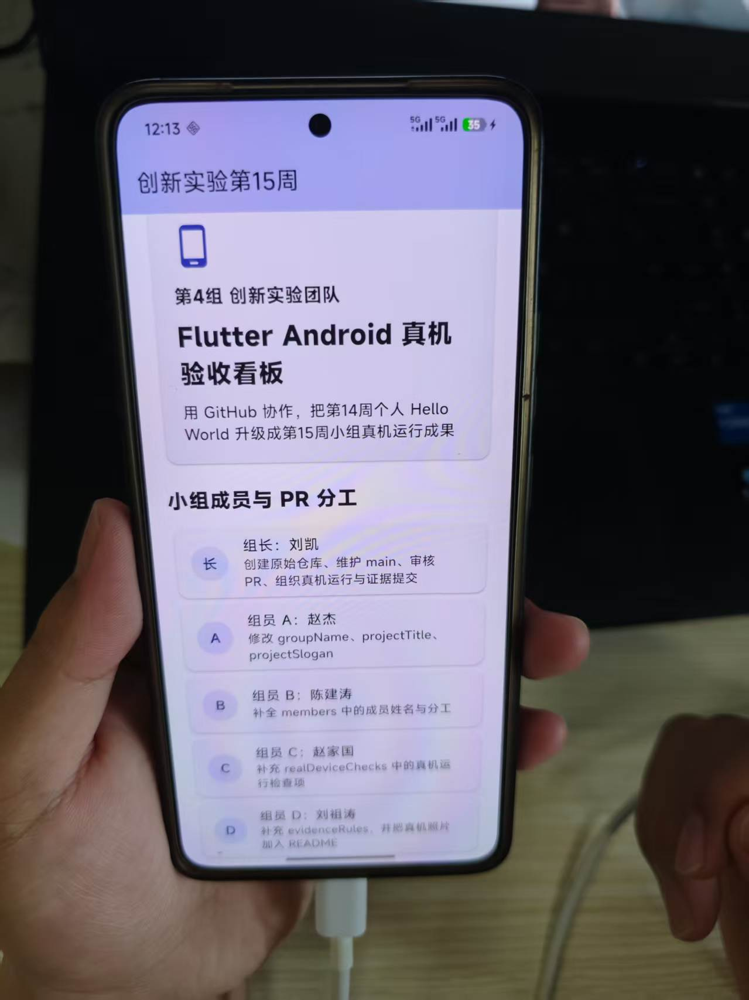
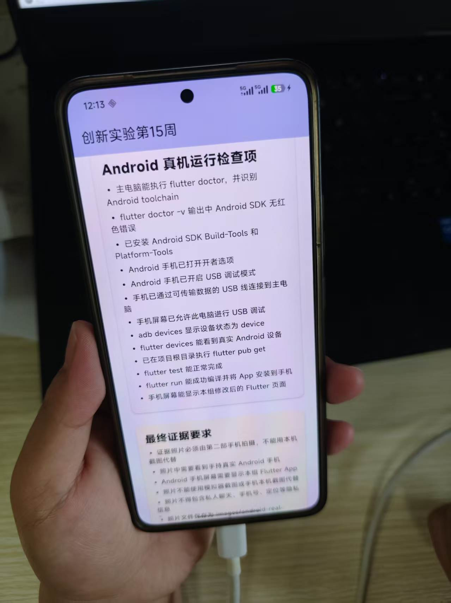

# 创新实验第15周：团队协作与 Android 真机运行

> 用 GitHub 协作，把第14周个人 Flutter Hello World 升级成小组真机运行成果

## 小组协作流程

小组成员需要完成：

1. 组长创建 GitHub 原始仓库
2. 4 名组员分别 Fork 仓库并创建个人分支
3. 每名组员只修改分配的区域并提交 Pull Request
4. 组长 Review 并合并 PR 到 `main` 分支
5. 主电脑连接 Android 真机运行最终 App
6. README 中展示分工、PR 合并记录和真机照片

## 小组成员与分工

| 角色 | 成员姓名 | 任务 |
| --- | --- | --- |
| 组长 | 刘凯 | 创建原始仓库、维护 main、审核 PR、组织真机运行与证据提交 |
| 组员 A | 赵杰 | 修改 `groupName`、`projectTitle`、`projectSlogan` |
| 组员 B | 陈建涛 | 补全 `members` 中的成员姓名与分工 |
| 组员 C | 赵家国 | 补充 `realDeviceChecks` 中的真机运行检查项 |
| 组员 D | 刘祖涛 | 补充 `evidenceRules`，并把真机照片加入 README |

## 真机运行命令

在主电脑上运行应用：

```bash
flutter pub get
flutter test
flutter run
```

如果连接有多个设备，查看设备列表：

```bash
flutter devices
```

选择 Android 真机运行：

```bash
flutter run -d 设备ID
```

## Android 真机检查

检查真机连接状态：

```bash
adb devices
flutter devices
```

`adb devices` 正常输出应为：

```
device
```

如果显示 `unauthorized`，请解锁手机并确认 USB 调试授权。

## 真机照片要求

照片文件应放在：

```
images/android-real-device.jpg
```

并在 README 中引用：

```markdown

```

### 拍照规范

- 照片必须由第二部手机拍摄，不能用本机截图代替
- 照片中要看到手持真实 Android 手机和本应用页面
- README 中要包含 GitHub 协作说明、PR 合并记录和真机照片
- 提交前检查照片不包含私人聊天、手机号、定位等隐私信息

## 最终真机运行照片

> 手机型号：华为 REA AN00 | 拍摄时间：2026-06-19 | 运行命令：`flutter run`

### 照片一：App 首页（小组成员与 PR 分工）


### 照片二：App 检查项页面（Android 真机运行检查项）



---

<p align="center">
  用 Flutter 与 GitHub 协作完成 — Innovation Team 4
</p>
